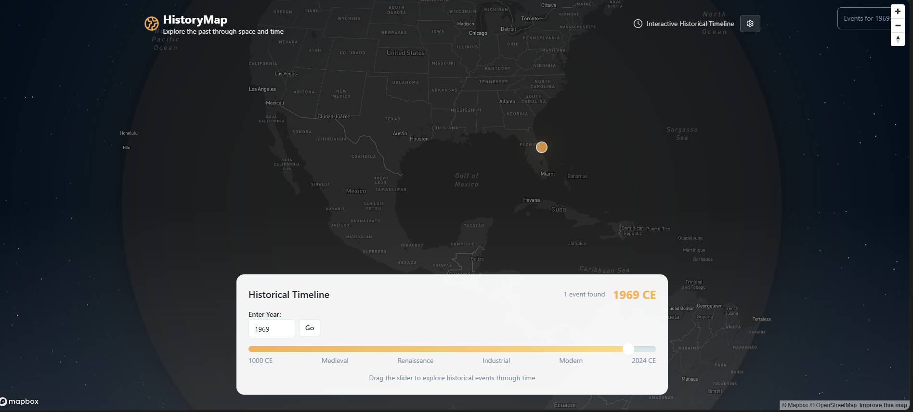
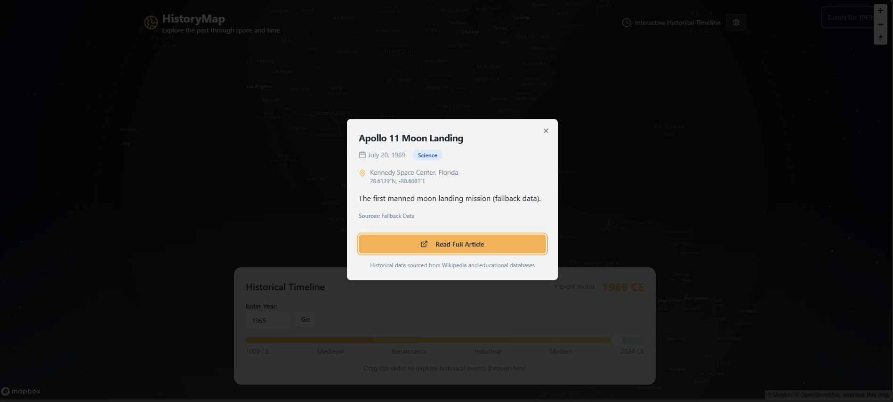

# **🌍 GeoTime**

**GeoTime** is an interactive, timeline-synced geographical visualization app designed to plot **global historical, cultural, and scientific events** on a 2D or 3D map interface. It enables users to explore thousands of events across space and time using a smooth, animated slider — all presented on a map or globe enriched with contextual markers and data overlays.

## 🔍 Overview

* 📍 **Event Mapping:** Visualizes thousands of events on a map using a timeline slider. Each marker represents a moment in history tied to a place and date.
* 🕰️ **Time Navigation:** A horizontal timeline slider lets you scrub through time. As you move, the event markers animate in and out to reflect the selected time window.
* 🗺️ **Interactive Globe or Map:** Powered initially by Mapbox (optionally switchable to open-source alternatives like MapLibre), the interface supports zoom, pan, and click-to-learn interactions.
* ⚡ **Optimized Performance:** (WIP) Marker clustering ensures smooth performance even with large datasets.
* 🧠 **AI-Powered Build:** Much of the development process — architecture planning, UI decisions, component scaffolding — was bootstrapped using **Lovable AI** and **Gemini CLI**

## **📑 Table of Contents**

- [Overview](#-overview)
- [Features](#-features)
- [Demo](#-demo)
- [Future Roadmap and Potential Features](#-future-roadmap-and-potential-features)
- [Origin](#-origin)
- [Quick Start](#quick-start)
- [API Endpoints](#api-endpoints)
- [Comparable Projects](#-comparable-projects)
- [Target Users & Use Cases](#-target-users--use-cases)
- [Risks & Challenges](#️-risks--challenges)
- [Potential Monetization & Growth Ideas](#-potential-monetization--growth-ideas)
- [Known Issues](#-known-issues)
- [Built With](#-built-with)
- [Lovable Prompt](#-lovable-prompt)
- [Author](#-author)
- [License](#-license)

## 🧭 Features

* 🌍 Interactive 3D Globe for displaying geo-located historical events
* 📅 Timeline slider to explore events across time
* 📌 Clickable Popup cards with **summaries, images, and Wikipedia links.**

## 🎥 Demo





## 🚀 Future Roadmap and Potential Features

* Add an Events Fetching Data Pipeline
* **LLM Generated Summary of Event in Side Panel** - Select an Event - Click on Generate Summary in Side Panel
* **LLM “History” Query** - Natural‑language request: *“Show me some political historical events that happened in New York in 1886”* changes the Year filter, Category Filter (if available) and the globe position to destination
* Add filters by **time range, region, or event category**. Add Color Code for categories
* Near Real-time updates using Wikipedia API
* **Day-level slider** for recent events (last 1 year)
* Ability to **compare two dates/eras** side by side
* **Country borders over time**
* **“What happened here on this date?”** – geosearch via location or GPS

## ✨ Origin

### **Initial Concept (7-8 years ago):**

As someone deeply interested in **History**, and even more in **Anthropology,** which I see as the study of how history itself evolves across **time** and **geography,** I often found myself falling into Wikipedia rabbit holes when searching about a topic. So somewhere in the late 2010s, I had an idea about this website to visualize history on a world map, with time as a dimension. The goal was to have a view of historical events geographically and chronologically.

### **Potential Inspiration Sources**

* **[Histography.io](https://histography.io/)**: Interactive visualization of historical events from Wikipedia, primarily timeline-based.
* **[Wikiverse.io](http://wikiverse.io/)** (Now Defunct): A "galactic reimagining" of Wikipedia where articles appear as stars clustered by similarity.

  * More details: [Wikiverse Showcase](https://www.informationisbeautifulawards.com/showcase/1182-wikiverse).
  * [Modern equivalent: ](https://meta.wikimedia.org/wiki/Wikihistorymap)[anvaka/map-of-github](https://meta.wikimedia.org/wiki/Wikihistorymap)[.](https://meta.wikimedia.org/wiki/Wikihistorymap)

### **Why Couldn't it be Built Back Then:**

I lacked full-stack web development skills at the time. However, with advancements in no-code tools like **Lovable**, the idea was now executable for me.

### **Additional Sources Found Today:**

* **Wikihistorymap -** Discovered an exact same idea laid out here \[July’25] -  [https://meta.wikimedia.org/wiki/Wikihistorymap](https://meta.wikimedia.org/wiki/Wikihistorymap) (Can’t find a Date Published for this)

* Purpose and Application Similar to GeaCron [http://geacron.com/the-geacron-project/](http://geacron.com/the-geacron-project/)

  * Quote from Official Website - “GeaCron’s mission is to make historic information universally accessible for everyone, through intuitive and attractive geo-temporal maps, as well as configurable timelines. We propose a different approach. We created a system to represent the historical events and the geopolitical maps of any region in the world, for any given historical time period.”
  * Quote from Founder Luis Múzquiz’s Story - “In 2011 Luis founded GeaCron in response to an idea that goes back to the 80s: a system to facilitate knowledge of historical events that have taken place every moment in our planet, in an interactive way and on a temporary geographical map.”

## **Quick Start**

```sh
# Install dependencies (frontend + backend)
npm install
cd server && npm install && cd ..

# Start both frontend and backend
npm run dev
```

Visit [http://localhost:8080](http://localhost:8080) and enter your Mapbox API key when prompted.

## **API Endpoints**

* `GET /api/events?year=1969` - Get historical events by year
* `GET /api/events/:id` - Get specific event details
* `GET /api/categories` - Get available categories

## 🔍 Comparable Projects

### **Closest Existing Tools**

* **[Chronas.org](https://www.chronas.org/)**:

  * History explorer with data until 2000 as well lacks full event coverage within that time frame

* **[Histography](https://histography.io/)**:

  * Timeline-based, Wikipedia-powered visualization. Less map-centric, more **timeline-first**.

* **HistoryMaps:**

  * Curated major events with modern storytelling elements.

* **Running Reality:**

  * More focused on **geopolitical mapping** and changes over time.

### **How this Web App Differs**

* Combines **Wikipedia/Wikidata parsing** for events with **geo-temporal mapping**
* Focuses on **macro-level events**, not just history groups (For Eg. The French Revolution)
* Prioritizes a **modern UX/UI with interactive storytelling**

## 🧑‍🎓 Target Users & Use Cases

* **Target Users:** Students, teachers, history enthusiasts, researchers, travelers, and anthropologists.

* **Use Cases:**

  * Education (visual learning in classrooms)
  * Research and historical comparisons
  * "Today in History" explorations
  * Travel and heritage tourism insights

## ⚠️ Risks & Challenges

* Data accuracy and completeness
* Performance when handling large datasets
* Licensing constraints for Wikipedia or historical maps

## 💰 Potential Monetization & Growth Ideas

* Run Ads on Homepage
* Freemium model for educators
* Paid premium features (e.g., custom historical overlays)
* API for third-party history apps

## **🐛 Known Issues**

## 🛠 Technical Overview

### **Architecture & Data Flow**

The application follows a client-server architecture with the following data flow:

1. **Data Source**: Historical events are stored in `public/demoEvents.json` containing structured event data with fields like title, year, coordinates, category, and description.

2. **Backend API**: Node.js/Express server (`server/src/index.js`) serves event data via REST endpoints:
   - `GET /api/events?year=YYYY` - Fetches events filtered by year
   - The `DataService.js` handles JSON file reading and caching with 5-minute expiry
   - `WikipediaService.js` provides Wikipedia API integration for additional event data

3. **Frontend Data Layer**: `HistoryDataService.ts` manages client-side data fetching, caching, and error handling with automatic cache invalidation on year changes.

### **Timeline Slider Implementation**

The timeline slider (`TimelineSlider.tsx`) provides dual functionality:
- **Year Selection**: Users can select specific years between 1000 BCE to 2025 CE
- **Range Selection**: Supports continuous year ranges with a maximum 5-year span
- **Input Methods**: Both slider interface and direct number input fields
- **Event Filtering**: Automatically triggers data refetch when year selection changes
- **BCE/CE Formatting**: Proper historical year formatting with negative values for BCE

### **Map Rendering & Visualization**

**Technology**: Mapbox GL JS with Supercluster for marker clustering

**Implementation** (`MapClustering.tsx`):
- **3D Globe**: Mapbox with `projection: 'globe'` for immersive experience
- **Authentication**: Dynamic API key input with localStorage persistence
- **Atmosphere Effects**: Fog and lighting effects for realistic globe appearance
- **Auto-rotation**: Gentle spinning animation when not interacting

### **Clustering Logic**

**Supercluster Integration**:
- **Dynamic Clustering**: Events are clustered based on zoom level and geographical proximity
- **Cluster Markers**: Display event count with click-to-zoom functionality
- **Individual Markers**: Show as distinct points when zoomed in sufficiently
- **Performance**: Efficiently handles large datasets by rendering only visible markers

### **Event Interaction System**

**Marker Behavior**:
- **Click Events**: Individual markers trigger `onEventSelect` callback
- **Popup Display**: Event details shown in modal overlay (`EventPopup.tsx`)
- **Wikipedia Integration**: Direct links to source articles
- **Responsive Design**: Adapts to different screen sizes and zoom levels

### **Backend Architecture**

**Express Server Structure**:
- **Static Data**: Demo events served from JSON file
- **Wikipedia Service**: Live data fetching with rate limiting and deduplication
- **Caching Strategy**: In-memory caching with configurable expiry times
- **CORS Handling**: Configured for cross-origin requests

### **Frontend Technology Stack**

**Core Technologies**:
- **React 18**: Component-based architecture with hooks
- **TypeScript**: Type safety and better developer experience
- **Tailwind CSS**: Utility-first styling with custom design tokens
- **Vite**: Fast development build tool
- **shadcn/ui**: Pre-built component library for consistent UI

**State Management**:
- **React Hooks**: useState, useEffect for local component state
- **Event Flow**: Props-based communication between components
- **Data Synchronization**: Automatic re-fetching on timeline changes

### **Performance Optimizations**

**Current Implementations**:
- **Marker Clustering**: Reduces DOM elements for large datasets
- **Data Caching**: Prevents redundant API calls
- **Lazy Loading**: Map renders only visible markers
- **Debounced Updates**: Prevents excessive re-renders during interactions

**Suggested Enhancements**:
- **Virtual Scrolling**: For timeline with dense event data
- **Progressive Loading**: Load events in time chunks
- **Image Optimization**: Lazy load event images in popups
- **Service Workers**: Offline caching for frequently accessed data

### **3D Interactions & Animations**

**Globe Interactions**:
- **Mouse/Touch Controls**: Pan, zoom, and rotate with Mapbox controls
- **Smooth Transitions**: Animated camera movements and marker appearances
- **Auto-rotation**: Configurable spinning with user interaction detection
- **Zoom-dependent Rendering**: Different marker styles based on zoom level

**Performance Considerations**:
- **WebGL Acceleration**: Hardware-accelerated rendering via Mapbox GL
- **Frame Rate Optimization**: Smooth 60fps animations
- **Memory Management**: Proper cleanup of map resources and event listeners

## 🛠 Built With

* **Frontend:** React, Tailwind CSS
* **Backend:** Node.js, Express
* **Other Tools:** Vite, TypeScript, shadcn-ui, VS Code
* **AI & Dev Tools:** Lovable (no-code deployment), ChatGPT (Debugging), Gemini CLI (Further Development)

## 🧠 Lovable Prompt

Build a visually engaging website with an interactive world map as the centerpiece. At the top, include a date filter (timeline slider or calendar) that allows users to select a specific date or range of dates. The site should parse Wikipedia (or a similar dataset) to gather historical events and display them as pins or markers on the map at their corresponding geographical locations. When a user clicks on a marker, show a popup with a summary of the event, relevant images, and a link to the full Wikipedia article. The interface should be minimal, modern, and intuitive, focusing on exploring history by time and place

## **👤 Author**

**Karan Gupta**

---

## **📜 License**

This project is licensed under the MIT License - see the [LICENSE](LICENSE) file for details.
